# SMSTester 使用手册

**SMSTester** 是一款用于 Android(安卓) 短信/彩信场景演示与测试的本地仿真工具。  
它会把你在页面上填写的内容写入系统短信/彩信数据库，用于验证界面与流程效果。

> 说明：本工具用于本地仿真测试，不会触发运营商真实收发。

## 目录

- [1. 你会看到哪些页面](#1-你会看到哪些页面)
- [2. 首次使用流程](#2-首次使用流程)
- [3. 模拟页（核心功能）](#3-模拟页核心功能)
- [4. 信息页（会话与详情）](#4-信息页会话与详情)
- [5. 关于页（授权设置与更新）](#5-关于页授权设置与更新)
- [6. 使用前提与权限](#6-使用前提与权限)
- [7. 常见问题](#7-常见问题)
- [8. 服务条款与免责声明](#8-服务条款与免责声明完整版)

## 1. 你会看到哪些页面

底部导航共 3 个入口：

- `模拟`
- `信息`
- `关于`

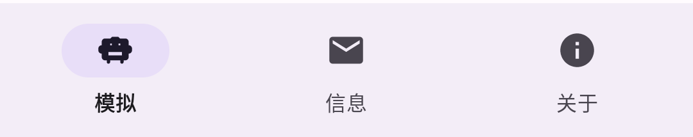

## 2. 首次使用流程

首次打开应用时，会出现阻断式《用户协议与免责声明》弹窗，需要先勾选同意才能进入主界面。

推荐按以下顺序操作：

1. 打开应用并同意协议。
2. 进入 `关于 -> 软件授权`，完成授权激活（如当前版本需要授权）。
3. 进入 `关于 -> 默认应用`，将 **SMSTester** 设为默认短信应用。
4. 返回 `模拟` 页，按系统弹窗授予相关权限。
5. 开始模拟短信/彩信。

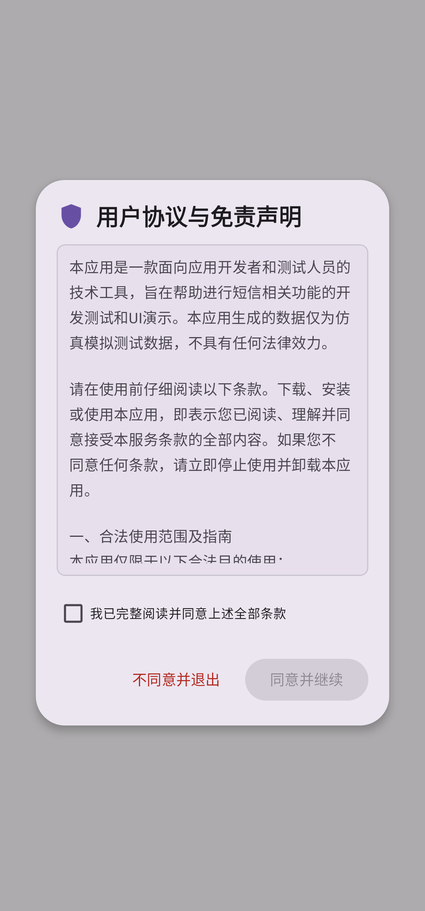 
  
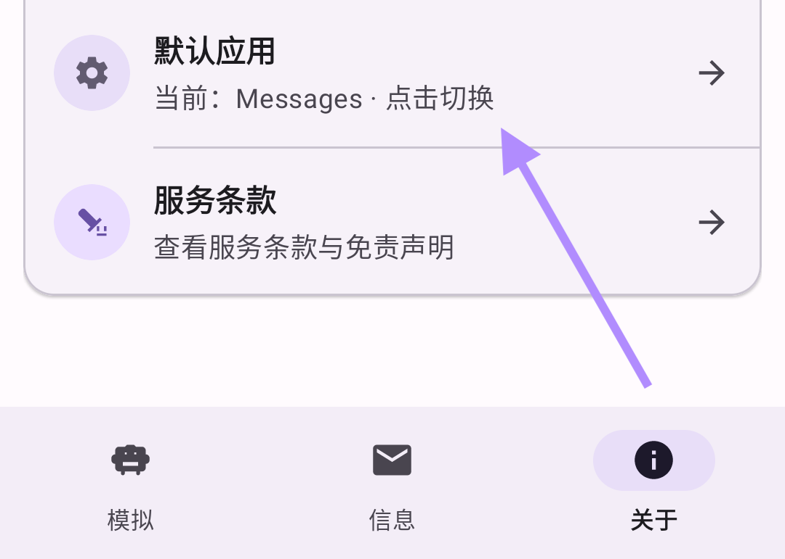

## 3. 模拟页（核心功能）

模拟页可在同一页面切换：

- 模拟类型：`短信` / `彩信`
- 模拟方向：`模拟接收` / `模拟发送`

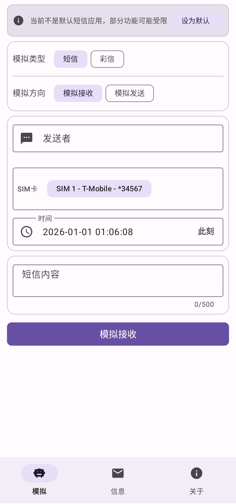

### 3.1 短信模拟

可填写并控制：

- 号码（接收模式显示为发送者，发送模式显示为收件人）
- 短信内容
- 时间（支持“此刻”快捷操作）
- SIM 卡（设备识别到可用 SIM 时显示）

点击底部按钮后执行模拟写入。

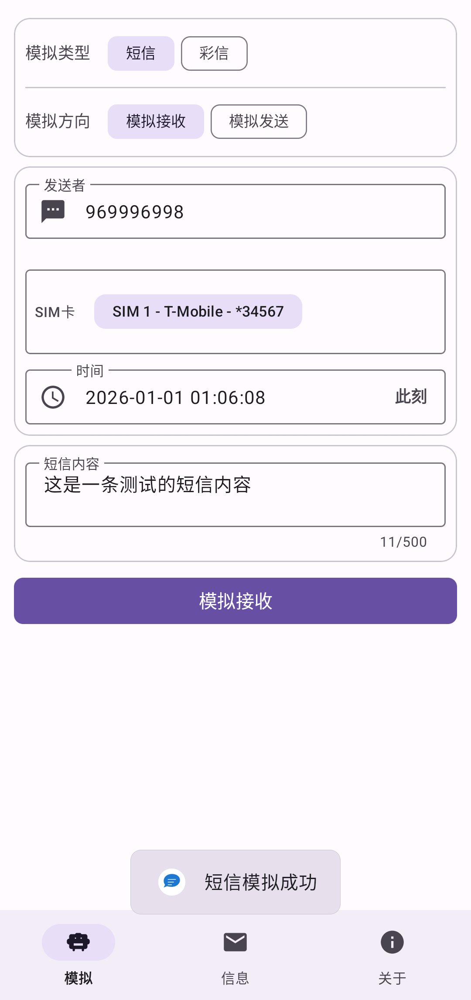

### 3.2 彩信模拟

可填写并控制：

- 号码
- 彩信主题（可选）
- 文字正文（可选）
- 附件（图片 / 视频 / 音频 / 联系人名片）
- 时间

彩信提交规则：

- `文字正文` 与 `附件` 至少保留一项
- 附件总大小不超过 `10MB`
- 图片最多 `15` 张

附件相关操作：

- 添加、删除
- 拖拽排序
- 预览
- 一键复用“上次添加”附件/图片

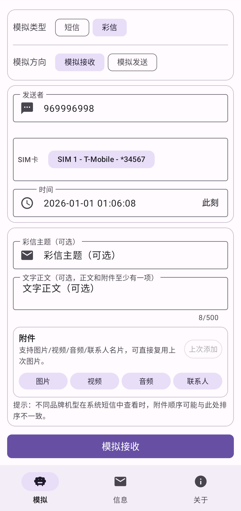
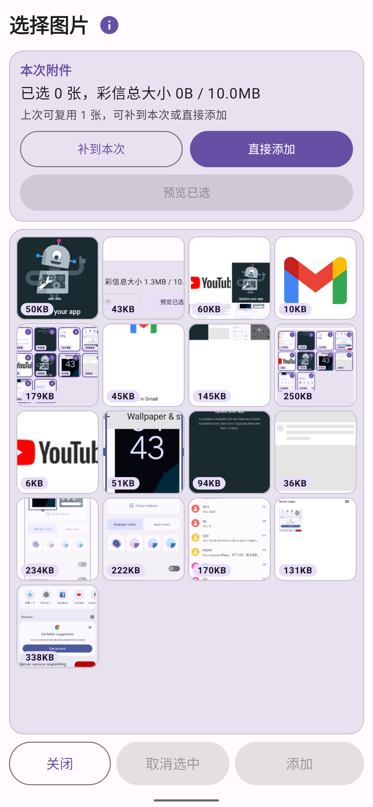
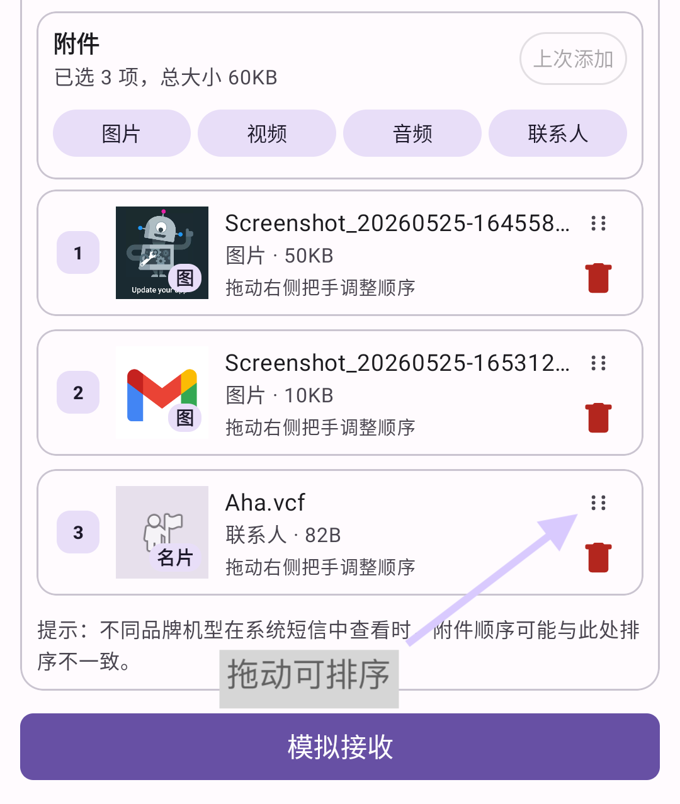

### 3.3 布局设置影响

`关于 -> 布局设置` 可以控制模拟页的：

- 样式（短信 / 彩信 / 混合）
- 收发模式策略
- 字段显示与字段记忆
- 成功提示（Toast）显示及停留时长

例如“模拟发送失败”选项，只会在满足对应配置和发送模式时显示。

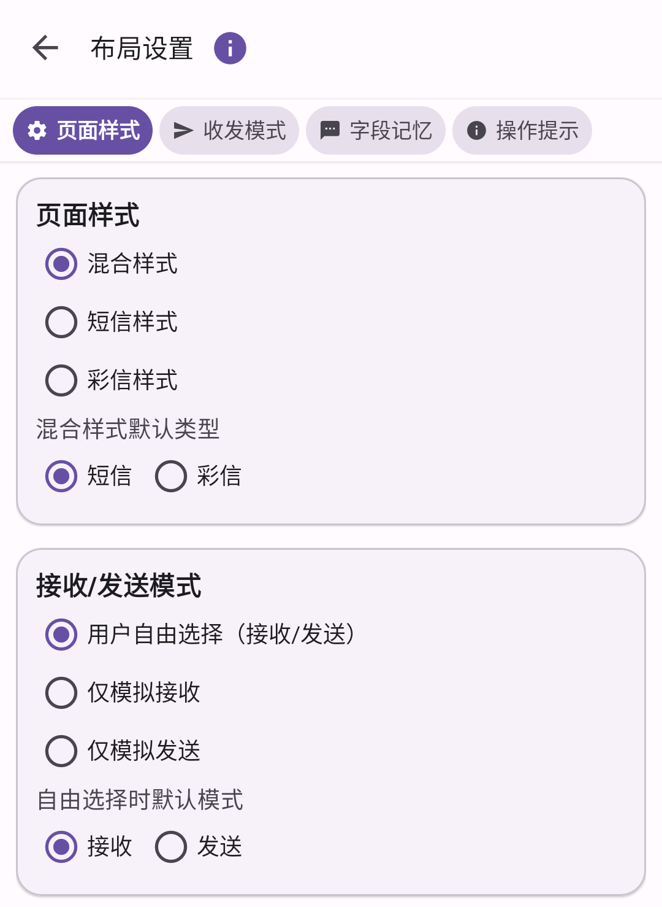
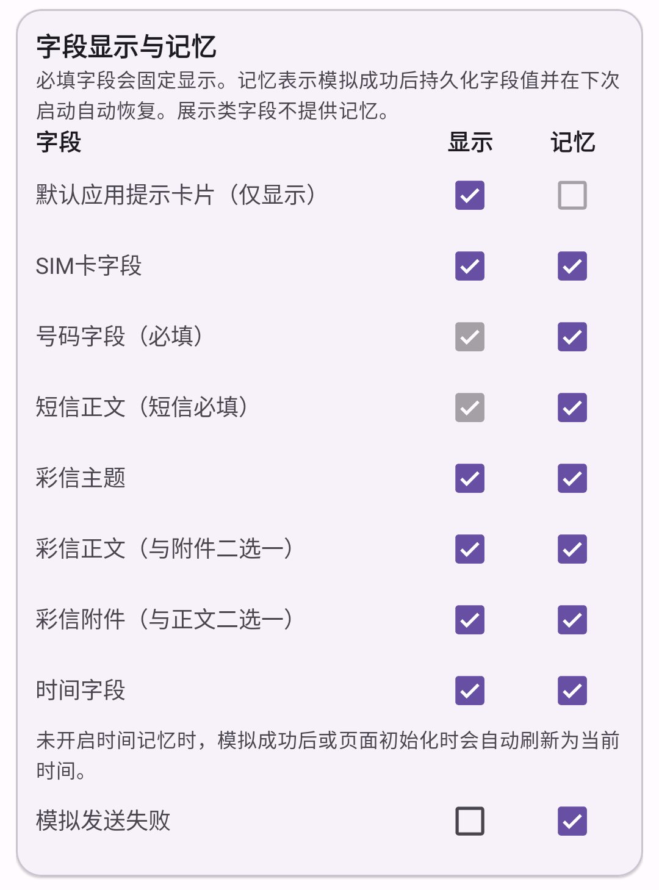
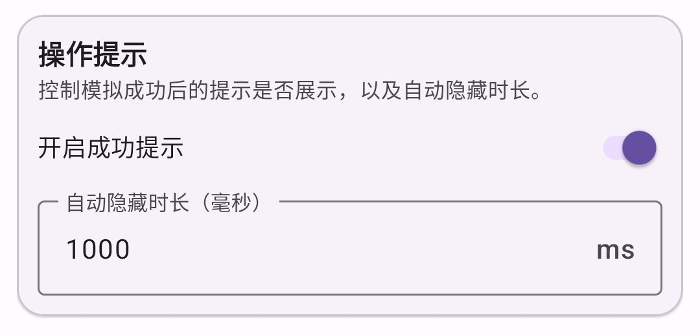

## 4. 信息页（会话与详情）

信息页用于查看系统会话与消息详情。

支持能力：

- 会话总数、未读会话数统计
- `全部` / `仅未读` 筛选
- 手动刷新（显示同步阶段与进度）
- 长按进入多选并批量删除会话

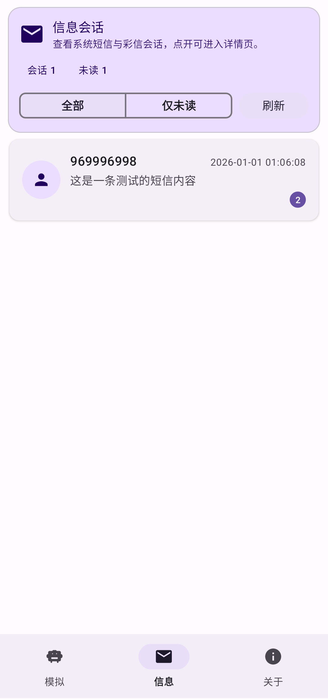
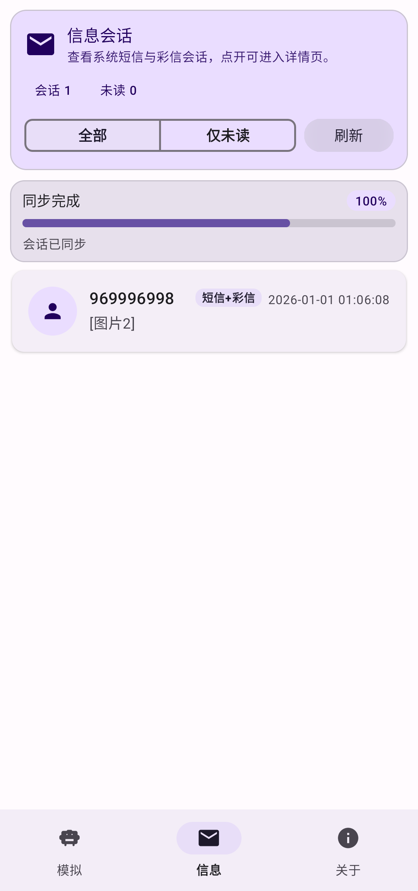

进入会话详情后支持：

- 查看消息时间线（短信/彩信）
- 底部输入框继续发送短信（本地模拟写入）
- 长按消息：复制 / 删除
- 右上角菜单：删除整条对话
- 点击彩信附件：图片全屏预览；其他类型调用系统应用打开

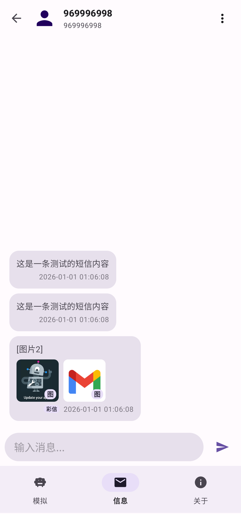
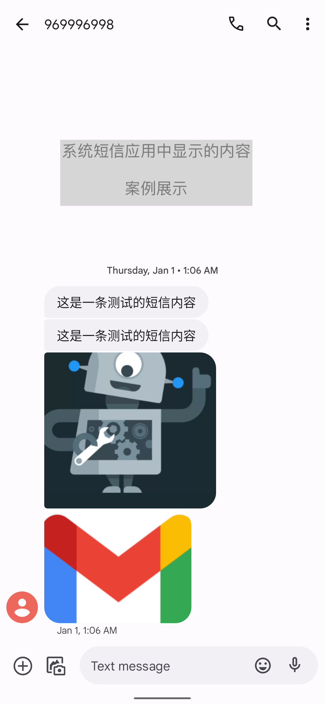

## 5. 关于页（授权设置与更新）

关于页包含以下入口：

- 使用说明
- 软件授权
- 布局设置
- 版本更新
- 默认应用
- 服务条款

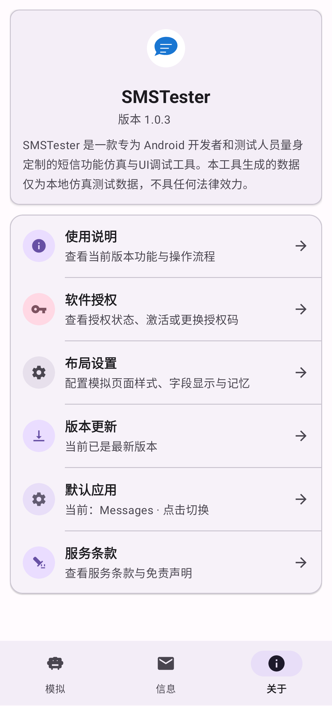

### 5.1 软件授权

可进行：

- 查看授权状态
- 输入授权码激活/更换
- 查看并复制设备 ID（设备指纹）
- 打开“如何获取授权码”入口

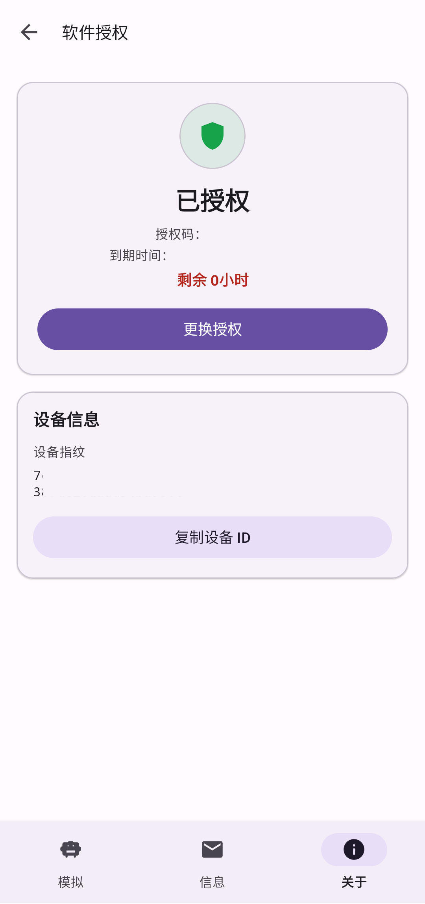

### 5.2 版本更新

可进行：

- 检查更新
- 下载更新包
- 拉起系统安装
- 下载/安装异常时重试

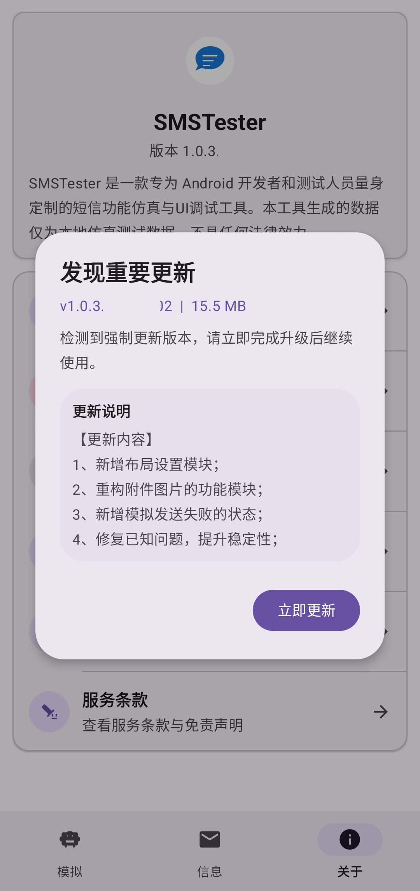

### 5.3 默认应用切换

可在应用内查看当前默认短信应用并发起切换。  
若系统未自动完成切换，页面会给出手动前往系统设置的引导。

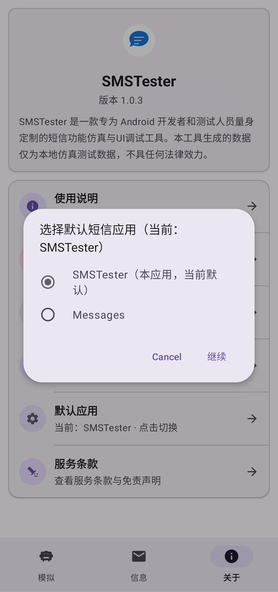

## 6. 使用前提与权限

关键前提：

- 执行短信/彩信写入时，**SMSTester** 需要处于默认短信应用身份。

常见权限（按功能触发申请）：

- 短信相关权限（短信读写与发送）
- 电话状态相关权限（SIM 识别）
- 媒体读取权限（添加图片）
- 通讯录权限（添加联系人名片）
- 通知权限（Android 13+）

## 7. 常见问题

### 1) 提示需要默认短信应用

进入 `关于 -> 默认应用` 先完成切换，再重试。

### 2) 彩信无法提交，提示正文和附件不能为空

彩信要求正文与附件至少保留一项。

### 3) 添加附件失败

检查是否重复添加，或是否超过 10MB 总大小 / 15 张图片上限。

### 4) 信息页看不到刚写入的数据

先点 `刷新`，再确认模拟时间是否设置在预期区间。

### 5) 看不到“模拟发送失败”选项

请到 `关于 -> 布局设置` 检查字段是否开启，且当前为发送模式。

### 6) 为什么会出现闪退（安全保护机制）

**SMSTester** 是商业级软件，对运行环境安全检测较严格。  
命中以下任一情况时，应用会触发保护机制并自动关闭（表现为闪退）：

- 设备处于调试状态（Debugger）。
- 存在注入 / Hook / 动态调试工具环境。
- 设备已 Root。
- 运行在虚拟机或模拟器环境（当前不支持）。

这属于安全策略的正常行为，不是普通功能异常。  
建议先排查设备环境并关闭相关工具，再重新尝试使用。

## 8. 服务条款与免责声明

- [点击查看：服务条款与免责声明](./服务条款与免责声明.md)
